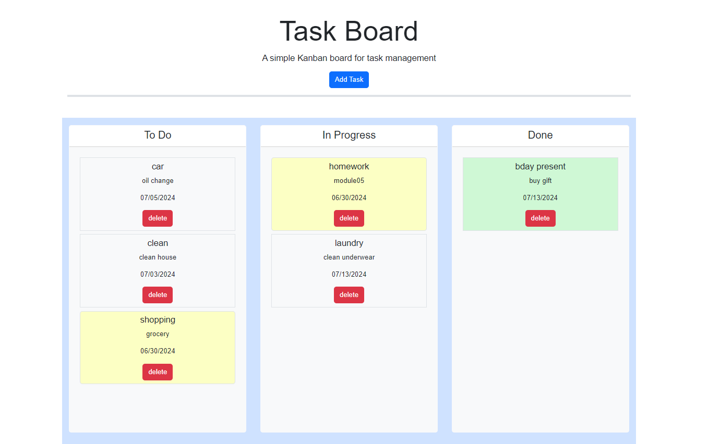

# task-board-app

## Description

This is task board that can be used to list visually tasks that need to be completed.  It allows for the user to create tasks and include a title, description and a due-date.  It then allows users to place tasks in one of 3 columns: to do, in progress and done.  When a task is within 24 hours of its due date, the task card will turn yelloe.  If the task is past due, the card will turn red.  All completed items will turn green when placed in the "Done" column.  Furthermore, tasks will be saved in the space they were dropped after refreshing. 

## Installation 

website can be accessed at: https://ddurmala.github.io/task-board-app/

## Usage

## Credits

coded and designed by Dana Castagna

© 2024 edX Boot Camps LLC.

## License
MIT License

Copyright (c) 2024 Dana Castagna

Permission is hereby granted, free of charge, to any person obtaining a copy
of this software and associated documentation files (the "Software"), to deal
in the Software without restriction, including without limitation the rights
to use, copy, modify, merge, publish, distribute, sublicense, and/or sell
copies of the Software, and to permit persons to whom the Software is
furnished to do so, subject to the following conditions:

The above copyright notice and this permission notice shall be included in all
copies or substantial portions of the Software.

THE SOFTWARE IS PROVIDED "AS IS", WITHOUT WARRANTY OF ANY KIND, EXPRESS OR
IMPLIED, INCLUDING BUT NOT LIMITED TO THE WARRANTIES OF MERCHANTABILITY,
FITNESS FOR A PARTICULAR PURPOSE AND NONINFRINGEMENT. IN NO EVENT SHALL THE
AUTHORS OR COPYRIGHT HOLDERS BE LIABLE FOR ANY CLAIM, DAMAGES OR OTHER
LIABILITY, WHETHER IN AN ACTION OF CONTRACT, TORT OR OTHERWISE, ARISING FROM,
OUT OF OR IN CONNECTION WITH THE SOFTWARE OR THE USE OR OTHER DEALINGS IN THE
SOFTWARE.

## Features

- create tasks with descriptions and due dates
- visually track deadlines with color coding
- move tasks into categoried according to their finished status
